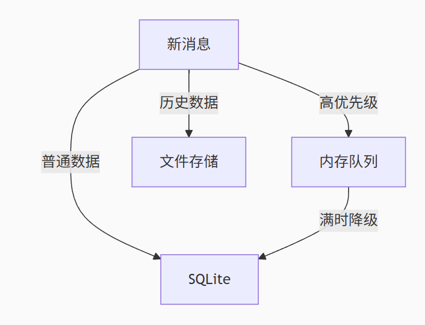
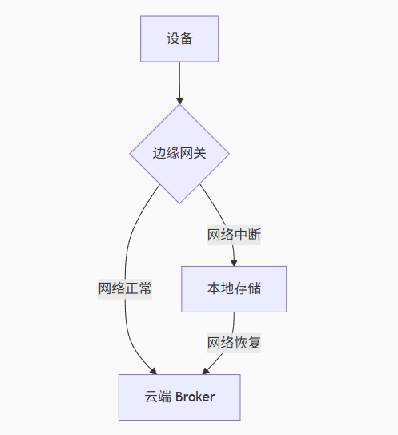

## 特点

### 极低功耗

协议头仅2字节

支持短连接、心跳保活

### 高可靠保证

QoS 分级

#### QoS0 至多一次

#### QoS1 至少一次

指令下发，保证到达

#### QoS2 精确一次

OTA升级，

### 海量设备接入

服务端无状态连接

单集群支持百万级设备量在线

### 实时性高，延迟低

基于TCP长连接，消息推送延迟 < 100ms

### 双向通信

### 安全机制

TLS/SSL 加密

客户端证书认证

ACL 主题权限控制

### 动态设备管理

遗嘱消息 （LWT），设备异常离线时自动发布预设消息

保留消息，保存设备最后的状态

## 发布/订阅模型

解耦，生产者与消费者无需知道对方的存在

通过 Broker 代理路由消息 

## HTTP 比较

|     HTTP痛点      |             MQTT              |
| ---------------- | ----------------------------- |
| 频繁轮询，耗电高   | 服务端主动推送，设备休眠时长增加 |
| 海量设备连接成本高 | 1个Broker 连接支撑10W+设备     |
| 弱网易断连         | 自动重连+离线消息缓存           |


## 无状态连接

### 连接与会话分离

外部存储实现会话的集群共享

|    概念     |       存储位置       |   生命周期   |               作用                |
| ---------- | ------------------- | ----------- | -------------------------------- |
| Connection | Broker内存           | TCP长连接    | 传输字节流                        |
| Session    | 持久化存储（LevelDB） | 保存离线消息 | 逻辑状态（已订阅的主题、QoS >0 消息 |

## emqx LevelDB

### 会话持久化

存储客户端会话状态（订阅主题列表、未确认的QoS1/2消息）

确保Broker节点故障后会话可跨节点恢复

Clean Session = false ，会话数据将按 ClientID 分片存储至LevelDB

支持高并发读写，单机吞吐可达7W写/秒

### 消息离线缓存

设备断线时，将待转发的消息暂存至 LevelDB 队列， 通过TTL策略自动清理过期数据

### 局限性

#### 非分布式架构

仅限单机部署，EMQX集群需为每个节点独立部署LevelDB实例

跨节点数据同步依赖 EMQX 的分布式会话存储机制

## 共享订阅

打破传统订阅中“一个消息会被分发给所有匹配的订阅者”

多个消费者并行处理同一主题的消息时，每条消息只被一个消费者处理

### 主题格式

`$share/{group-name}/{topic-filter}`

* $share：固定前缀标识共享订阅

* group-name：自定义订阅组名（如 sensor-group）

* topic-filter：实际订阅主题（如 sensors/+/temperature）

### 引入了“订阅组”概念

多个消费者可加入同一个共享订阅组来订阅同一个主题

Broker 会确保发布到该主题的消息，只会被分发给组内的其中一个消费者实例，取决于负载均衡策略

### 共享订阅组

一个逻辑上的消费者组，拥有唯一的组标识符（group_name）

### 组内成员

订阅时指定了相同共享组名的各个消费者客户端

### 负载均衡

负责均衡地将消息分发给组内成员

### 消息分发策略

每条消息，有且仅有一个组内成员会收到它

#### 随机分发（默认）

#### 轮询

#### 哈希分发

基于 ClientID 或消息属性

## 断线导致消息挤压

### 服务端（Broker 层）

#### 消息队列配置

1、合理设置消息队列最大长度

`zone.external.max_mqueue_len = 5000    # 最大队列长度`

内存保护机制，防止单个"问题客户端"(长时间离线或处理极慢)导致整个 EMQX 节点内存耗尽

消息暂存在内存

消息队列长度超过设定的阈值

最旧的消息会被丢弃

只保存QoS1和QoS1消息

2、不存储 QoS0 级别的消息

`zone.external.mqueue_store_qos0 = false # 不存储 QoS0`

#### 消息过期策略配置

##### TTL过期

`message_expiry_interval=3600	1 小时后自动丢弃旧消息`

##### 分级存储

热数据存在内存，冷数据存在磁盘

##### 低优先级丢弃

### 客户端

#### 断线自动重连机制

```
// 客户端重连策略 (指数退避)
var options = new MqttClientOptionsBuilder()
    .WithConnectionBackoff(retryCount: 10, 
                          minDelay: TimeSpan.FromSeconds(1),
                          maxDelay: TimeSpan.FromSeconds(60))
    .WithAutoReconnect(true);
```

#### 本地消息缓存，批量上报




#### 消息去重、压缩

#### 消息分级处理

关键指令消息用独立线程处理

普通数据用线程池处理

### 增设边缘消息网关

断网时本地缓存7天数据

网络恢复后分批发送消息



## 高并发、高可用架构设计

### 接入层

#### 基于Nginx 代理负载均衡

```
# Nginx 四层代理配置
stream {
  upstream mqtt_cluster {
    zone tcp_servers 64k;
    server 10.0.1.1:1883 max_fails=2 fail_timeout=15s;
    server 10.0.1.2:1883 backup;
  }
  server {
    listen 1883;
    proxy_pass mqtt_cluster;
    proxy_connect_timeout 3s;
  }
}
```

### 服务层

#### Broker 集群

##### 主从架构、Raft协议自动选主

##### 会话存储

Redis、 RocksDB

## 顺序消费

|  保障级别   |       实现方式       |    典型场景	    | 延迟影响 |
| ---------- | ------------------- | -------------- | -------- |
| 单连接有序   | TCP 协议保证         | 单设备连续上报	 | 无       |
| 单会话有序	 | QoS 1/2 + 客户端队列 |      设备指令下发	          | 低       |
| 设备级有序   | 分区键绑定 + 单消费者 | 设备状态同步	  | 中       |
| 全局有序    | 外部协调服务 + 单分区 | 金融交易	     | 高       |

### QoS 0 不保证顺序，可能丢包乱序

### QoS 1 单连接内保证顺序（需Broker实现队列）

emqx实现

```
# 启用顺序队列插件
emqx_ctl plugins load emqx_sequential_actions

# 配置设备级顺序
sequential_actions.by = "clientid"  # 按设备ID保序
sequential_actions.max_queue = 1000 # 队列深度
```

### QoS 2 严格单会话保证顺序

### 设备级分区键

基于设备ID哈希绑定固定消费者

```
partition = hash(device_id) % consumer_count
topic = $"commands/{partition}/{device_id}"
client.subscribe(f"commands/{partition}/+")
```

相同设备消息始终由同一个消费者处理

