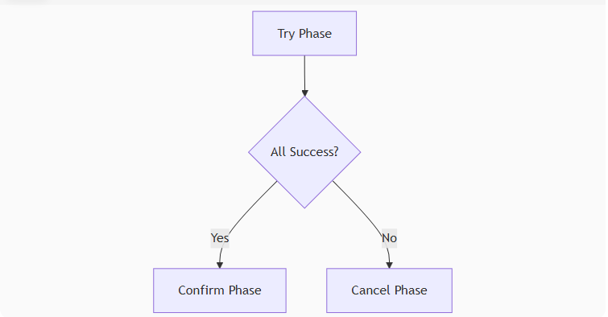
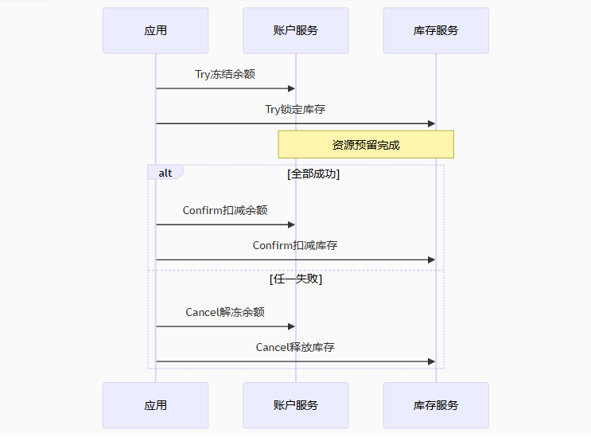
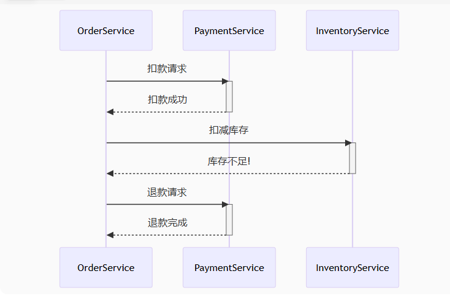
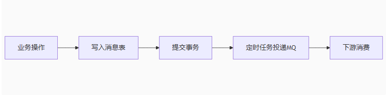
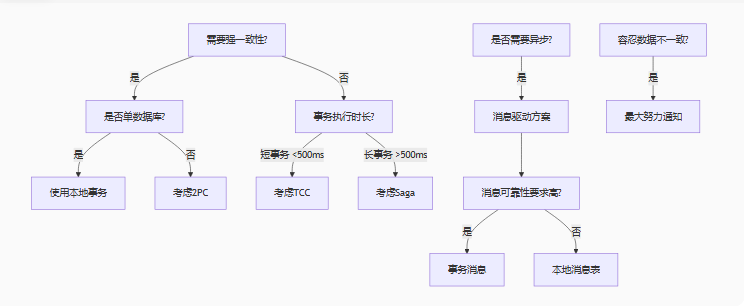

# 分布式事务

## 事务

ACID

原子性 atomicity

一致性 consistency

隔离性 isolation

持久性 durability

分布式系统下，网络出错是必然存在的

CAP(consistency、availability、partition tolerance)

一致性、可用性、分区容错


## Base理论

Basically Available （基本可用）

Soft state （软状态）

Eventually consistent （最终一致性）

分布式系统，可用性最重要

				
		低	低	金融支付
	最终	高	高	高并发业务（电商库存）
	最终	中	中	长流程业务（订单履约）
	最终	中	中	旧系统改造
	最终	高	低	异步解耦（订单+积分）
	最终	高	低	微服务架构


|    方案    | 一致性  | 性能 | 侵入性 |       适用场景        |
| ---------- | ------ | ---- | ------ | -------------------- |
| XA/2PC     | 强一致  | 低   | 低     | 金融支付              |
| TCC        | 	最终  | 高   | 高     | 高并发业务（电商库存） |
| Saga       | 	最终  | 中   | 中     | 长流程业务（订单履约） |
| 本地消息表  | 	最终  | 中   | 中     | 旧系统改造            |
| MQ事务消息 | 	最终 | 高   | 低     | 异步解耦（订单+积分）  |
| Seata AT   | 	最终  | 高   | 低     | 微服务架构            |

## 强一致性方案 (ACID)

### 两阶段提交（2PC）

XA协议   

#### 原理

准备阶段：协调者询问所有参与者能否提交，参与者锁定资源返返回就绪状态

提交阶段：若全部就绪，协调者通知提交，否则回滚

#### 优点

强一致性，数据库原生支持（XA事务）

#### 缺点

同步阻塞，资源锁定时间长

协调者单点故障

数据不一致风险（部分参与者未收到 Commit）

#### 场景

银行转账，库存扣减等一致性要求极高的低频操作

```
-- 在 DB1 上执行
XA START 'xid1';  -- 开启事务（xid1为全局唯一ID）
INSERT INTO db1.table1 VALUES (1, 'data1');
XA END 'xid1';    -- 结束事务
XA PREPARE 'xid1'; -- 进入准备阶段

-- 在 DB2 上执行
XA START 'xid1';  -- 使用相同的xid
INSERT INTO db2.table2 VALUES (2, 'data2');
XA END 'xid1';
XA PREPARE 'xid1';

-- 若所有实例均PREPARE成功，则提交所有事务
XA COMMIT 'xid1'; -- 在DB1执行
XA COMMIT 'xid1'; -- 在DB2执行

-- 若有任何实例PREPARE失败，则回滚所有事务
XA ROLLBACK 'xid1'; -- 在DB1执行
XA ROLLBACK 'xid1'; -- 在DB2执行
```

### 三阶段提交（3PC）

#### 原理

##### 1、CanCommit 事务询问

此阶段仅作可行性检查，避免资源过早锁定，减少阻塞

###### 协调者

向所有参与者发送 CanCommit 请求，询问事务可行性（不执行实际操作）

等待参与者响应，超时未响应视为No

###### 参与者

检查本地资源（磁盘空间、锁可用性），不锁定资源

返回 yes （可提交）或 no （不可提交）

##### 2、PreCommit 事务预执行

日志记录，提供故障容错

###### 协调者

全部响应 yes：发送 PreCommit 请求，进入预提交状态

任一响应 No 或超时：发送 abort 请求中止事务

###### 参与者

收到 PreCommit，

执行事务操作，写入 undo 、redo 日志，锁定资源（未提交）

返回 ACK 确认，等待最终指令

超时未收到协调者消息，自动中止事务

##### 3、DoCommit 提交

###### 协调者

收到所有 ACK：发送 DoCommit 请求事务

未收全 ACK 或 收到 No：发送 abort 请求回滚
    
###### 参与者

收到 DoCommit： 提交事务，释放资源，返回 ACK

收到 Abort： 用 undo 日志回滚，释放资源

超时处理：若未收到协调者指令，默认提交事务（因 PreCommit 已达成共识）

#### 优化点

##### 超时机制

###### 协调者超时

CanCommit 阶段未响应，中止事务

PreCommit 阶段未响应，重发请求后触发参与者超时处理

###### 参与者超时

PreCommit 阶段未收到指令，自动终止

DoCommit 阶段未收到指令，默认提交，依赖 PreCommit 的共识

##### 故障恢复

###### 协调者故障

新协调者根据日志状态决定

PreCommit 状态，重发 Commit

CanCommit 状态，中止事务

###### 参与者故障

恢复后查询其他节点状态，同步至最新决策

#### 缺点

##### 数据不一致风险

DoCommit 阶段超时默认提交，若协调者实际发送了 Abort ，会导致部分提交部分回滚

##### 性能开销

三阶段通信增加网络延迟，高并发场景性能低于2PC

##### 实现复杂

需维护事务日志、超时重试、状态恢复等机制，代码复杂度较高

#### 场景

对可用性要求高于强一致性的系统

## 最终一致性方案(BASE)

### TCC 

Try-Confirm-Cancel





#### 原理

##### Try 阶段

资源预留 （锁定 / 冻结）

##### Confirm 阶段

提交实际业务 （使用预留资源）

##### Cancel 阶段

回滚补偿 （释放预留资源）

#### 存在问题

##### 空回滚处理    

Try 未执行时 Cancel 被调用

```
public void cancel(Long orderId) {
    if (!tryLogExists(orderId)) return; // 检查Try日志
    doCompensate();
}
```

##### 悬挂问题

Cancel 比 Try 先到达

```
public void try() {
    if (cancelLogExists(orderId)) return; // 检查Cancel日志
    reserveResources();
}
```

### Saga模式

面向长事务，特别适合跨多个服务的业务场景

不需要资源预留，通过补偿操作实现最终一致性

#### 原理

事务拆分：将大事务拆分为多个本地事务（子事务）

补偿操作：每个子事务都有对应的补偿操作（回滚逻辑）

执行顺序： T1 -> T2 -> ... -> Tn 

失败回滚，Tn -> ...-> T1

#### 执行模式

| 模式 |       协调        | 复杂度 | 耦合度 |
| ---- | ---------------- | ------ | ------ |
| 编排 | 服务间直接通信     | 低     | 高     |
| 协调 | 中央协调器统一调度 | 高     |  低      |

#### 编排模式




## 消息驱动方案

### 本地消息表



上游投递消息

下游获取消息

上游投递稳定性

下游接受稳定性

把长动作拆分成短动作

## 方案选择

强一致性场景：选择 XA （低频）或 TCC （高频） 

最终一致性场景：消息队列 > Saga > Seata AT

金融系统：TCC + 对账机制

电商系统： MQ 事务消息 + 补偿任务

微服务架构：SeaTa AT + Nacos 配置中心



## 幂等性保证

通过唯一ID （订单号） + Redis 原子操作

```
String key = "order_" + orderId;
if (redis.setnx(key, "1", 300)) { // 设置5分钟过期
    //    处理订单逻辑
}
```

      