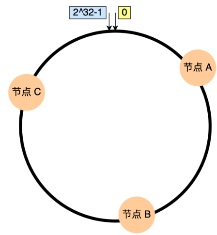

## 算法

### 轮询

### 加权轮询

根据服务器处理能力分配权重，保证高性能服务器接收更多请求

### 最小连接

### 加权最小连接

优化高配置服务器的利用率

### IP 哈希

客户端 IP 哈希值固定分配到同一个服务器

### 一致性哈希算法

哈希值用2^32取模，

可用服务器均匀分配在哈希环上

### 随机算法
 

## DNS(Domain Name System) 负载均衡

1、部署多个独立的IP对外提供服务

2、DNS服务器配置多个IP

3、DNS解析时转发

高效（就近原则)

只能轮询（多个独立IP，费用高）

错误不易发现

## 软件负载均衡

#### LVS(Linux Virtual Server)

4层协议

轮询转发(不能根据报文信息转发)

#### HAProxy

4层/7层协议

转发灵活

主流 Nginx

