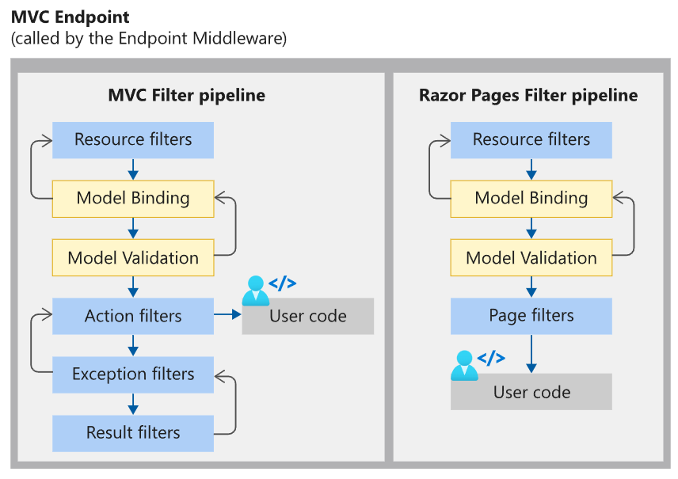

# Kestrel

精简高效的 Http Server，以包形式提供，自身不能单独运行

核心是名为 libuv 的异步事件处理库，它也是 Node.js 的核心

内部封装了对 libuv 的调用， 作为 I/O 底层，屏蔽了各系统底层实现差异

是ASP.NET Core 代码实际执行的地方，IIS 只是作为一个反向代理，将所有的请求发送到 Kestrel

ASP.NET Core 前，ASP.NET 都是宿主在 IIS 进程 w3wp.exe 中

IIS 反向代理

浏览器 -->  IIS/Nginx转发 -->  Kestrel监听   & 解析HttpContext

ASP.NET Core 中带有一个全新的 IIS 模块：ASP NET Core Module ，这个原生的模块会将 HTTP 请求转发给运行在另一个独立进程中的 Kestrel，

Web.Config文件中，加载了 ASPNetCoreModule

DbContext  使用 Scoped 注册

# 启动流程


## HostBuilder 

Host.CreateDefaultBuilder(args) 创建 

配置宿主服务 IHostService **GenericWebHostService **监听

## Host

## IHostService


## 中间件



## ResourceFilter

实例化控制器后，拦截Action，不进入Action方法

# 中间件缓存


services.AddResponseCaching();

app.UseResponseCaching();

配合ResponseCacheAttribute，配置缓存条件

# 依赖注入

实现 IDisposable 接口类型的释放

- DI 只负责释放其创建的对象实例，如果这个对象是自己创建出来并放到容器里的，容器不负责释放这个对象
- DI 在容器或子容器释放时，才会释放由其创建的对象实例

**避免在根容器获取实现了 IDisposable 接口的瞬时服务**

**避免手动创建实现了 IDisposable 的服务，然后塞到容器里面，应该用容器来管理其生命周期**

```C#
public void ConfigureServices(IServiceCollection services)
{
	services.AddTransient<IService, Service>();
}

public void Configure(IApplicationBuilder app)
{
	var service = app.ApplicationService.GetService<IService>();
	// 从根容器获取的瞬时服务，对象无法回收，直到应用结束
}

var service = HttpContext.RequestServices.CreateScope().ServiceProvider.GetService<IService>();
```

### 需要引入第三方的容器组件

- 基于名称的注入，名称区分多实现

- 属性注入

  原生属性注入 [FromService]

- 子容器

- 基于动态代理的 AOP

public interface IServiceProviderFactory<TContainerBuilder>

Autofac.Extensions.DependencyInjection

Autofac.Extras.DynamicProxy

```c#
public static IHostBuilder CreateHostBuilder(string[] args) =>
    Host.CreateDefaultBuilder(args)
        .UseServiceProviderFactory(new AutofacServiceProviderFactory())
        .ConfigureWebHostDefaults(webBuilder =>
        {
        webBuilder.UseStartup<Startup>();
        });
public class Startup
{
	public void ConfigureContainer(ContainerBuilder builder)
    {
        builder.RegisterType<MyService>().As<IService>();
    }    
}
```

# 配置框架

Microsoft.Extensions.Configuration.Abstractions

Microsoft.Extensions.Configuration

IConfigurationSource

ConfigurationProvider

configurationRoot.GetReloadToken().RegisterChangeCallback();

ChangeToken.OnChange()

# 异常处理

app.UseExceptionHandler()

# IHttpClientFactory


# Authentication & Authorization

## IClaimsTransformation

每次请求，HttpContext.User 不为空时触发，异步填充 Claims

```c#
services.AddScoped<IClaimsTransformation, ClaimsTransformation>();

public class ClaimsTransformation : IClaimsTransformation
{
    public Task<ClaimsPrincipal> TransformAsync(ClaimsPrincipal principal)
    {
        var hasFriendClaim = principal.Claims.Any(x => x.Type == "Friend");
        if (!hasFriendClaim)
        {
	        ((ClaimsIdentity) principal.Identity).AddClaim(new Claim("Friend", "Bad"));
        }
        return Task.FromResult(principal);
    }
}
```

## IAuthorizationPolicyProvider

### DefaultAuthorizationPolicyProvider

```c#
serivces.AddSingleton<IAuthorizationPolicyProvider, CustomAuthorizationPolicyProvider>();

public class CustomAuthorizationPolicyProvider
    : DefaultAuthorizationPolicyProvider
{
    public CustomAuthorizationPolicyProvider(IOptions<AuthorizationOptions> options) : base(options)
    {
    }

    public override Task<AuthorizationPolicy> GetPolicyAsync(string policyName)
    {
        foreach (var customPolicy in DynamicPolicies.Get())
        {
            if (policyName.StartsWith(customPolicy))
            {
                var policy = DynamicAuthorizationPilicyFactory.Create(policyName);

                return Task.FromResult(policy);
            }
        }

        return base.GetPolicyAsync(policyName);
    }
}
public class SecurityLevelAttribute : AuthorizeAttribute
{
    public SecurityLevelAttribute(int level)
    {
        Policy = $"{DynamicPolicies.SecurityLevel}.{level}"; 
    }
}

// {type}
public static class DynamicPolicies
{
    public static IEnumerable<string> Get()
    {
        yield return SecurityLevel;
        yield return Rank;
    }

    public const string SecurityLevel = "SecurityLevel";
    public const string Rank = "Rank";
}

public static class DynamicAuthorizationPilicyFactory
{
    public static AuthorizationPolicy Create(string policyName)
    {
        var parts = policyName.Split('.');
        var type = parts.First();
        var value = parts.Last();

        switch (type)
        {
            case DynamicPolicies.Rank:
                return new AuthorizationPolicyBuilder()
                    .RequireClaim("Rank", value)
                    .Build();
            case DynamicPolicies.SecurityLevel:
                return new AuthorizationPolicyBuilder()
                    .AddRequirements(new SecurityLevelRequirement(Convert.ToInt32(value)))
                    .Build();
            default:
                return null;
        }
    }
}
public class SecurityLevelRequirement : IAuthorizationRequirement
{
    public int Level { get; }
    public SecurityLevelRequirement(int level)
    {
        Level = level;
    }
}
public class SecurityLevelHandler : AuthorizationHandler<SecurityLevelRequirement>
{
    protected override Task HandleRequirementAsync(
        AuthorizationHandlerContext context,
        SecurityLevelRequirement requirement)
    {
        var claimValue = Convert.ToInt32(context.User.Claims
                                         .FirstOrDefault(x => x.Type == DynamicPolicies.SecurityLevel)
                                         ?.Value ?? "0");

        if (requirement.Level <= claimValue)
        {
            context.Succeed(requirement);
        }
        return Task.CompletedTask;
    }
}


```

# IPostConfigureOptions

```c#
builder.Services.TryAddEnumerable(ServiceDescriptor.Singleton<IPostConfigureOptions<JwtBearerOptions>, JwtBearerPostConfigureOptions>());
```

# IAuthenticationHandler

## IAuthenticationRequestHandler

```c#
var handlers = httpContext.RequestServices.GetRequiredService<IAuthenticationHandlerProvider>();
foreach (var scheme in await Schemes.GetRequestHandlerSchemesAsync())
{
    if (await handlers.GetHandlerAsync(httpContext, scheme.Name) is IAuthenticationRequestHandler handler && await handler.HandleRequestAsync())
    {
    	context.Fail();
    	return;
    }
}

var defaultAuthenticate = await Schemes.GetDefaultAuthenticateSchemeAsync();
var result = await httpContext.AuthenticateAsync(defaultAuthenticate.Name);
```

# IServiceScopeFactory

```
using var scope = _serviceScopeFactory.CreateAsyncScope();

scope.ServiceProvider.GetService<IRedisCounter>();
```