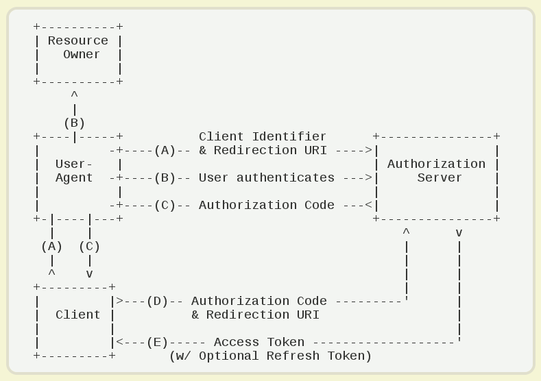
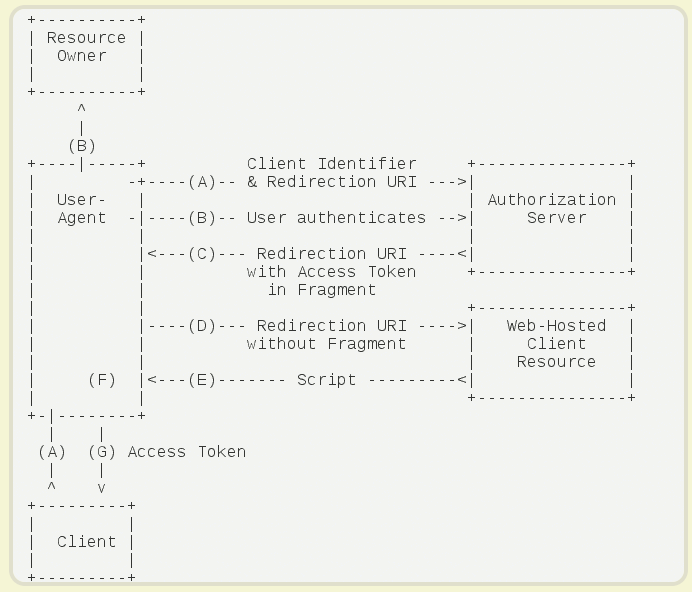
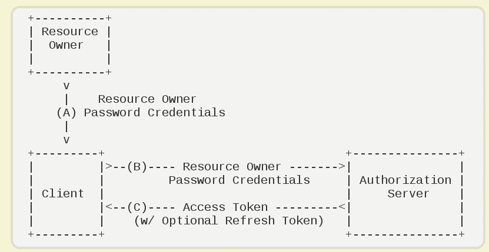
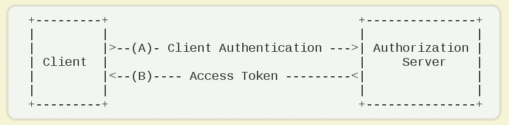

# Identity Server 4

## OAuth 2.0

委托协议，可以让控制资源的人允许某个应用以**代表他们**来访问资源（非假冒、模仿），应用从资源的所有者获得授权（Authorization）和 access token，随后就可以用这个 access token 来访问资源

授权和认证

OAuth 2.0 授权 Authorization ，你能干什么

OpenId Connect 身份认证 Authentication，你是谁

### 授权方式

#### authorization code

授权码

有后端应用

第三方应用先申请一个授权码，然后再用该码获取令牌

#### implicit

隐藏式

纯前端应用

#### Resource Owner Password Credentials

密码式

使用用户给出的第三方网站用户名、密码，申请令牌

#### Client Credentials

凭证式

适用于没有前端的命令行应用

客户端应用不代表用户，客户端应用本身相当于资源所有者

通常用于机器与机器的通信

客户端需要身份认证

## OpenId Connect

## JWT token VS Reference Token 

### JWT token

- 信息自包含，验证时无需和 IDP 通信
- 没有提供直接的生命周期控制

### Reference Token

适用安全性要求更高的系统

- 身份标识，连接到在 IDP 存储的 Token
- 端点 Token instrospection endpoint
- 直接的生命周期控制，但是与 IDP 的通信很频繁

## JwtBearerHandler

## AuthorizationHandler 

## AuthenticationHandler

