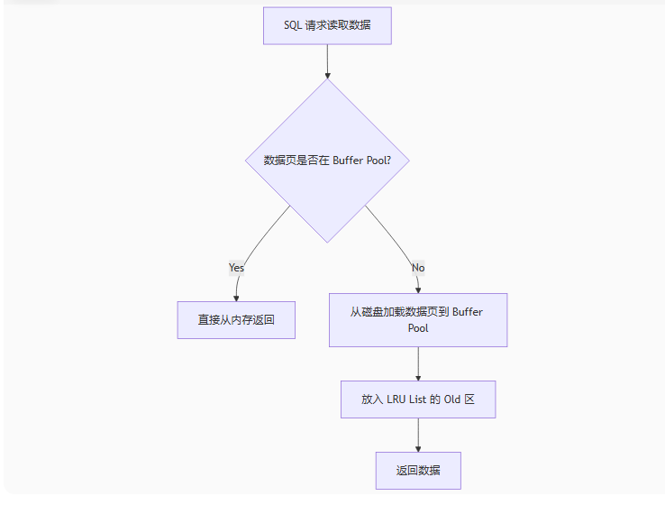
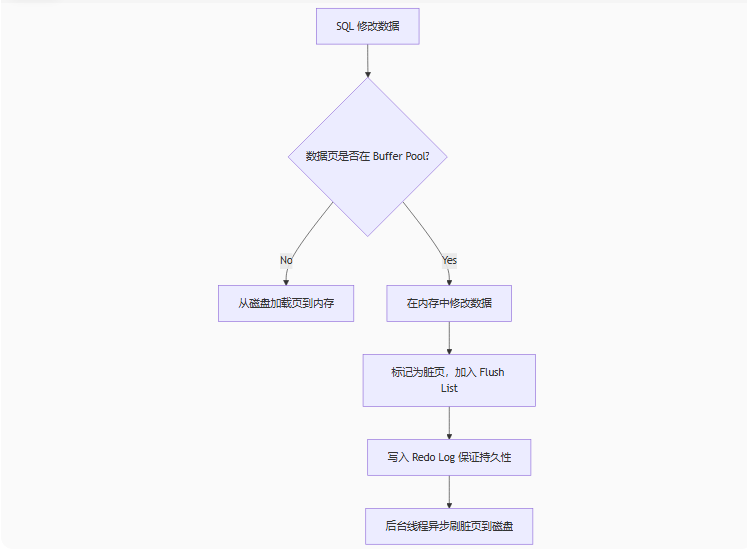
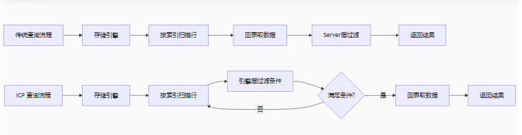
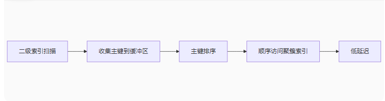
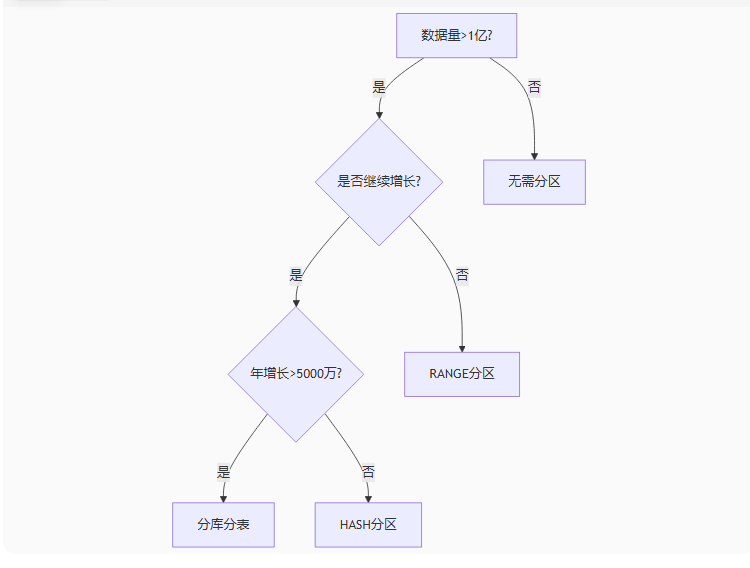
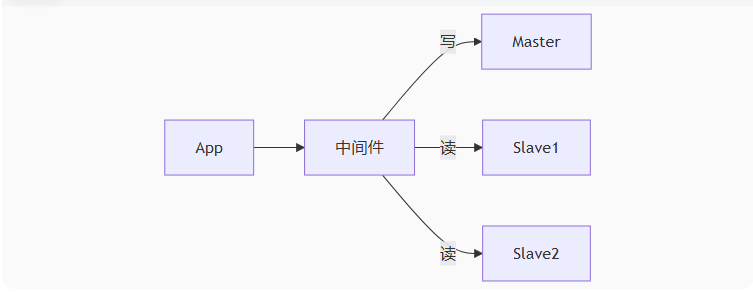
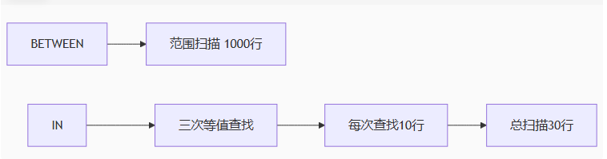

# MySQL

## 索引原理

https://tech.meituan.com/2014/06/30/mysql-index.html

## 磁盘 IO 与预读

磁盘读取数据靠的是机械运动，每次读取数据花费的时间可以分为寻道时间、旋转延迟、传输时间

- 寻道时间：磁臂移动到指定磁道所需要的时间，主流磁盘一般在 5ms 以下
- 旋转延迟：磁盘转速，如磁盘7200 转，一秒转 120 次，旋转延迟 1/120/2=4.17ms
- 传输时间：磁盘读出或将数据写入磁盘的时间，一般在零点几毫秒，相对于前两个可忽略不计

考虑到磁盘 IO 是非常高昂的操作，操作系统做了一些优化，一次 IO 时，不止把当前磁盘地址的数据，还把相邻的数据也都读取到内存缓冲区内，因为局部预读性原理告诉我们，当计算机访问一个地址的数据的时候，相邻的数据也会被访问到。每次IO读取到的数据称为一页，具体一页有多大数据跟操作系统有关，一般为 4k 或 8k

B+树


## 建索引的原则

- 最左前缀原则

- 尽量选择区分度高的列作为索引，区分度的公式 count(distinct col) / count(*)，

  一般需要 join 的字段要求是 0.1 以上，即平均 1 条扫描10条记录

- 索引列不能参与计算，避免使用函数

- 尽量扩展索引，不要新建索引，修改原来的索引

## 慢查询优化基本步骤

1. 运行看看是否真的很慢，注意设置 SQL_NO_CACHE，SELECT SQL_NO_CACHE id from t1
2. where 条件单表查，锁定最小返回记录表。这句话的意思是把查询语句的 where 都应用到表中返回的记录数最小的表开始查起，单表每个字段分别查询，看哪个字段的区分度最高
3. explain 查看执行计划，是否与 2 预期一致（从锁定记录较少的表开始查询）
4. order by limit 形式的 sql 语句让排序的表优先查
5. 了解业务方使用场景
6. 加索引时参照建索引的几大原则
7. 观察结果，不符合预期继续从 1 分析

## MySQL 读数据流程


## MySQL 写数据流程


## Buffer Pool

查看运行状态

```
命令：
SHOW ENGINE INNODB STATUS\G  
输出：
----------------------
BUFFER POOL AND MEMORY
----------------------
Total memory allocated 137363456;  # Buffer Pool 总大小
Database pages         8192        # LRU List 中数据页数量
Free buffers           1024        # Free List 中空闲页数量
Modified db pages      400         # Flush List 中脏页数量
Pages made young 1000, not young 0  # 页从Old移到New区的次数
```

合理设置 Buffer Pool 大小

推荐为物理内存的 50% - 80%

```
innodb_buffer_pool_size = 2147483648; // 2GB
```

### 基本单元

每页 16 KB，可通过 innodb_page_size 调整

### 内存管理

#### Free List

管理未被使用的空闲页

#### LRU List

管理已被加载的页（含数据页和索引页），按访问热度排序

New Sublist（热数据区，占比5/8）：频繁访问的页

Old Sublist（冷数据区，占比3/8）：新加载的页（通过 innodb_old_blocks_pct 调整比例）

新页首次加载到 Old 区，只有满足以下条件才进入 New 区：

访问时间 > innodb_old_blocks_time（默认1秒）。

设计目的：避免全表扫描等操作瞬间淘汰热数据。

#### Flush List	

管理被修改过的脏页（Dirty Page），按修改时间（LSN）排序

后台线程刷盘

#### Unzip_LRU List	

管理压缩表解压后的页


## 事务的基本特性和隔离级别

事务： 表示多个数据操作组成一个完整的事务单元，这个事务内的所有操作要么同时成功，要么同时失败

特性： ACID

### 原子性

事务是不可分割的，所有操作要么全部成功，要么全部失败
   
实现机制：
   
    * undo log，事务执行前，数据库会记录操作的备份数据，事务失败，通过 undo log 将数据恢复到事务开始前的状态   
    
    * 原子操作，数据库引擎通过底层的原子操作（如行锁）确保事务的不可分割性 

### 一致性 
    
事务执行必须使数据库从一个一致的状态转换到另一个一致的状态
    
需要应用层和数据库层共同维护

一致是指
        
    数据完整性约束，满足预定义的规则（主键唯一、外键约束、非空约束、数据类型、CHECK 约束）

        CHECK约束：限制列中的取值范围
        
                MySQL 5.7.6 及更高版本：直接支持 CHECK 约束。
                
                MySQL 5.7.5 及以下版本：可以通过触发器等技术来模拟 CHECK 约束的功能           
    
    业务逻辑一致性，数据变化符合业务规则（账户余额不能为负数、订单总额=单价*数量）

事务的最终目标，原子性、隔离性、持久性都是为实现一致性服务的手段

### 隔离性

当多个并发事务操作一个数据，需要对每个事务进行隔离，互相不干扰
    
实现机制：
    
    * 锁机制，行锁、表锁等限制并发事务对数据的访问
    
    * 多版本并发控制（MVVC）,通过保存数据的多个版本，允许事务读取一致性快照，避免直接锁表
    
#### 隔离级别
        
##### 读未提交 Read Uncommitted

最低级别，允许脏读

##### 读已提交 Read Committed

避免脏读，可能出现不可重复读（一个事务多次读取相同数据的结果不一样，两次查询中间，数据被其他已提交的事务修改了）

##### 可重复读 Repeatable Read

Mysql默认级别，避免脏读和不可重复读，但可能出现幻读

##### 串行化 Serializable

最高级别，完全隔离，并发性能最差（表锁）

```
查询事务的隔离级别：

SHOW VARIABLES LIKE '%transaction%'

设置隔离级别：

set transaction level xxx 设置下次事务的隔离级别

set session transaction level xxx

set global transaction level xxx

```

#### MVCC

核心目标是实现无锁读

快照读

读操作走 MVCC，写操作走锁

传统锁机制中，读会阻塞写，写会阻塞读

高频读写场景下，锁竞争会导致吞吐量下降

靠锁实现串行化隔离级别，性能极低

##### 设计哲学

空间换时间、延迟可见性

##### 隐式字段

每行数据的隐藏字段，记录行版本信息

* DB_TRX_ID（6字节）：最近修改该行的事务ID

* DB_ROLL_PTR（7字节）：指向Undo Log中上一个旧版本数据的地址，形成数据的版本链（mysql 8.0 优化，）

* DB_ROW_ID（6字节）：行ID（无主键时自动生成）

##### undo log

存储数据的历史版本，独立表空间（undo_001）

##### ReadView

事务的快照，决定哪些版本可见，内存数据结构

RC隔离级别下，每次 select 查询都会生成一次 ReadView

RR隔离级别下，只在第一次 select 查询会生成 ReadView 

事务执行 SELECT 时生成，包含：

###### m_ids 
表示在生成“ReadView”时当前系统中未提交事务的id列表

###### min_trx_id 

表示在生成“ReadView”时当前系统中未提交事务中最小的id，即 m_ids 中的最小值

###### max_trx_id 

表示生成“ReadView”时系统预分配的下一个事务的id值

###### creator_trx_id 

表示创建该“ReadView”的事务id

##### 版本链

通过指针串联数据的历史版本

版本可见性规则

* 若数据行 trx_id < min_trx_id → 可见（该事务已提交）

* 若 trx_id = creator_trx_id → 可见（当前事务自身修改）

* 若 trx_id > max_trx_id → 不可见（该事务在ReadView之后开启）

* 若 trx_id 包含在 m_ids → 不可见（事务未提交），反之可以

### 持久性

事务一旦提交，执行结果永久性保存在数据库中，即使异常宕机，数据也不会丢失

实现机制： 
    
    * redo log，事务提交时，数据库会将操作记录写入 redo log，并持久化到磁盘，在系统时崩溃时恢复事务操作
    
        innodb_flush_log_at_trx_commit 参数设置刷盘频率
    
    * 磁盘持久化，数据最终会从内存刷新到磁盘，确保物理存储的可靠性

## 隐式 Commit


## 脏读

事务多次查询某条数据时，另一个事务对这个数据进行了修改（未提交，可能回滚），再次查询会读到了其他事务未提交的数据，


## 幻读

同一事务中，两次范围查询返回的行数不一致，其他事务新增或删除了符合查询条件的行

数据似乎消失或出现

### 核心原因

范围查询无法完全通过行锁覆盖，新增或删除的行可能出现在间隙中

### MVCC 无法解决幻读的场景

在RR（可重复读）隔离级别下，只能解决快照读的幻读问题，无法完全解决当前读的幻读问题

InnoDB 在RR隔离级别下，默认通过 MVCC + 间隙锁 （Gap Lock）的组合方案实现完整的幻读防护

#### 快照读不会发生幻读

基于事务首次 SELECT 的 ReadView 快照读取数据

其他事务的新增、删除操作对当前事务不可见

#### 当前读（Locking Read）的幻读

SELECT ... FOR UPDATE

WAIT n 

设置超时时间，避免死锁

```
-- 事务A（RR级别）
BEGIN;
SELECT * FROM users WHERE age > 20;  -- 快照读：返回5行

-- 事务B
INSERT INTO users(age) VALUES(25);  -- 新增一行并提交

-- 事务A执行当前读
SELECT * FROM users WHERE age > 20 FOR UPDATE; -- 当前读：返回6行（出现幻行！）
```
#### MVCC + 间隙锁

```
-- 事务A
BEGIN;
SELECT * FROM users WHERE age > 20 FOR UPDATE; -- 当前读 + 加临键锁（行锁+间隙锁）

-- 事务B
INSERT INTO users(age) VALUES(25);  -- 阻塞！等待事务A释放锁
```

索引优化：未命中索引的查询会锁全表，须确保条件字段有索引

### 特殊场景：半一致性读（Semi--Consistent Read）

RC 隔离级别下，InnoDB 对未提交的更新采用特殊处理

```
-- 事务A（RC级别）
UPDATE users SET name='Bob' WHERE age > 20; -- 遇到被锁定的行会跳过
```
可能只更新部分行，导致类似幻读的结果不一致

解决方案： 升级到 RR 级别 + 显示加锁

### 业务场景的“伪幻读”

```
-- 事务A
BEGIN;
SELECT * FROM products WHERE stock > 0; -- 返回商品A（stock=1）

-- 事务B
UPDATE products SET stock=0 WHERE id=1; -- 售出商品A并提交

-- 事务A尝试购买
UPDATE products SET stock=stock-1 WHERE id=1; -- 成功但影响0行！
```
现象：更新失败，类似“幻消失”

本质：业务逻辑一致性问题，数据库层面无幻读，RR 下 MVCC 保证两次读一致

解决方案：

```
SELECT ... FOR UPDATE; -- 首次查询时加锁
```

## 不可重复读

在一个事务过程中，对数据的多次查询结果不一致

## Innodb 中的 B+ 树

### B树 vs B+树
|     特性     |           B+树           |        B树         |
| ----------- | ------------------------ | ------------------ |
| 数据存储位置 | 仅叶子节点存储数据         | 所有节点均可存储数据 |
| 叶子节点链接 | 通过双向链表串联          | 无链接              |
| 查询稳定性   | 任何查询都需要到达叶子节点 | 可能在非叶子节点命中 |
| 范围查询效率 | 高效                     | 差，须回溯遍历       |

### 关键特点

非叶子节点：仅存储索引键 + 子节点指针

叶子节点：存储完整数据（聚餐索引）或主键值（二级索引）	

双向链表：支持高效范围扫描	
		
## 索引

### 行记录存储格式

#### Compact 格式

`| 变长字段长度列表 | NULL标志位 | 记录头信息 (5B) | 主键值 | 事务ID (6B) | 回滚指针 (7B) | 列1值 | 列2值 | ...s`

节省空间，适合平均行长度 < 1 KB 的表

#### Dynamic 格式

行溢出处理： > 8 KB 的数据存到溢出页，主页仅留20字节指针

更高效处理大对象（BLOB / TEXT）

#### 主键设计原则

##### 自增int / bigint

避免随机写入导致页分裂

禁用 UUID 主键，随机写入破坏顺序

### 聚簇索引

#### 物理存储顺序

按主键排序存储数据行

#### 存储内容

`
| 页头 (38B) | 行记录 (变长) | 空闲空间 | 页目录 (Slot) | 页尾 (8B) |
`

每张表只能有一个聚簇索引

理想情况下，查询仅需1次甚至 0 次磁盘 I/O

B+树深度3层，根节点常驻内存，通常会被缓存，中间节点也可能被缓存，特别是热数据

因此，可能只需要读取叶子节点的那一次 I/O，如果数据已经被缓存，则 0 次 I/O

如果树深度更大，可能需要多次 I/O


### 二级索引

#### 存储内容

`| 索引列值 | 主键值 | 事务ID/回滚指针（MVCC） |`

叶子节点仅存储主键值

需回表查询聚簇索引获取完整的行数据

保证即使数据行位置变动，索引也无需重建

覆盖索引可避免回表（索引列包含所有要查询的列）

## 最左前缀原则

索引键的存储顺序决定了搜索必须从左开始

查询条件必须包含索引的最左列，索引才能被有效利用

适用于 WHERE 子句，也适用于 ORDER BY 和 GROUP BY

联合索引（col1, col2, col3）,先按 col1 排序，再按 col2 排序，再按 col3 排序，最后按主键值排序（解决重复值问题）

### 特殊场景

#### 覆盖索引优化

```
-- 查询字段全在索引中
SELECT name, age FROM users 
WHERE age=30;  -- 即使未用name列
```

#### 范围查询后列索引失效

范围查询条件后面的列，无法作为有效的索引查询条件

可能被用作索引过滤条件，但效率远不如等值查询

当对 col1 使用访问查询（>, <, between），

能快速定位 col1 满足范围的起始点，

但这个范围内，col2 和 col3 的值是无序的，索引无法高效利用 col2 和 col3 进行下一步的精确查询或排序

##### 范围查询后的列在哪些场景可能被利用

###### 索引下推

MySQL 5.6+ 支持

遍历索引时过滤不满足的条目，减少回表次数

减少回表次数，但索引扫描范围不变

###### ORDER BY / GROUP BY 优化

如果 ORDER BY 或 GROUP BY 的列紧跟在范围查询列之后且顺序一致，可能利用索引排序

```
-- 索引: (age, city)
SELECT * FROM users
WHERE age > 30
ORDER BY age, city; -- 可利用索引排序（避免 filesort）
```

###### 尝试用 in 代替范围查询

用 in 代替 between

```
-- 优化前
WHERE date BETWEEN '2023-01-01' AND '2023-01-05';

-- 优化后（若日期值离散且少）
WHERE date IN ('2023-01-01', '2023-01-02', ..., '2023-01-05');
```

###### 索引合并 

index merge

为列单独建索引， 可能触发 index_merge ,但效率通常不如 联合索引

##### 是否回表

1. 使用了覆盖索引

查询的所有列（SELECT 列 + WHERE / JOIN / GROUP BY / ORDER BY 用到的列）都包含在联合索引

无需回表

2. 没有使用覆盖索引

引擎通过索引找到符合条件的主键后，必须回到主键索引（聚簇索引）中查找完整的行数据

## Mysql 8.0 跳跃扫描

使用联合索引，查询不符合最左前缀原则

查询必须符合覆盖索引

联合索引的最左列的唯一值较少

动态拆解查询后，合并结果

```
SELECT f1, f2 FROM t1 WHERE f2 > 40

等同于

SELECT f1, f2 FROM t1 WHERE f1=1 AND f2>40
UNION ALL
SELECT f1, f2 FROM t1 WHERE f1=2 AND f2>40;
```

### EXPLAIN 输出

type：通常显示 range

key：显示使用的复合索引名称

Extra：明确出现 Using index for skip scan

## 索引条件下推

Index Condition Pushdown ICP

MySQL 5.6+ 支持

减少回表次数，索引扫描范围不变

范围查询导致后列索引失效，不能用于索引查找，存储引擎会在遍历索引时直接过滤掉不满足的条目，减少回表次数

### 工作原理


### EXPLAIN 执行计划

Extra： Using index condition：ICP 生效标志

### 优化

#### 索引列使用函数

避免函数操作，导致 ICP 失效

```
-- 避免函数操作（导致ICP失效）
WHERE TIMESTAMPDIFF(YEAR, birth_date, NOW()) > 18  -- ❌ 失效

-- 改为可下推形式
WHERE birth_date < DATE_SUB(NOW(), INTERVAL 18 YEAR)  -- ✅ 有效
```

### 关键区别

#### 传统流程

所有索引匹配行都回表，在 Server 层过滤

#### ICP 流程

引擎层先过滤，仅满足条件的行才回表

## 倒排索引

MySQL本身没有名为“倒排索引”的索引类型

倒排索引是搜索引擎（Elasticsearch等）和支持全文检索的数据库（PostgreSQL的全文检索）的核心数据结构

专门为高效的文本搜索设计

### FULLTEXT 索引

实现类似倒排索引

## 执行计划


|      字段       |         关键值         |                      含义                      |        优化建议        |
| -------------- | --------------------- | --------------------------------------------- | --------------------- |
| id             | 1,2,3...	             | 查询序列号（相同id为同级查询，不同id从大到小执行）	 | 优化子查询顺序          |
| select_type	 | SIMPLE                | 简单查询（无子查询/UNION）                       |                       |
|                | PRIMARY               | 外层主查询                                      |                       |
|                | SUBQUERY	             | 	子查询                                        | 考虑改写为JOIN         |
|                | DERIVED               | 派生表（FROM子句中的子查询）                     | 	避免多层派生           |
| type	         | system                | 系统表仅1行                                     | 	最优性能               |
| (关键指标)	     | const                 | 主键/唯一索引等值查询                            | 理想状态               |
|                | eq_ref	             | JOIN时使用主键/唯一索引                         | 确保关联字段索引        |
|                | ref	                 | 非唯一索引等值查询                              | 检查索引区分度         |
|                | range                 | 索引范围扫描（BETWEEN, >, <）                   | 避免大范围扫描          |
|                | index                 | 全索引扫描（比ALL快）                           | 检查是否需回表          |
|                | ALL                   | 全表扫描                                       | 必须优化               |
| possible_keys  |                       | 可能使用的索引                                  | 检查为何未使用          |
| key	         |                       | 实际使用的索引                                  | 确认索引有效性          |
| key_len        | 数值（字节数）          | 索引使用长度	                                 |                       |
| ref	         | const/字段名           | 索引匹配值	                                  | 检查类型匹配           |
| rows	         | 估算行数               | 	扫描行数（InnoDB为统计估值）                    | 对比实际行数           |
| filtered       | 百分比（0~100）         | 存储引擎返回数据在Server层过滤的比例              | >20%需警惕             |
| Extra          | Using index	         | 覆盖索引，无需回表                              | 理想状态               |
| (关键指标)      | Using where	         | Server层对数据过滤                              | 检查索引失效           |
|                | Using temporary	     | 使用临时表（排序/分组）                          | 优化GROUP BY/ORDER BY |
|                | Using filesort	     | 额外文件排序                                    | 添加索引优化排序        |
|                | Using join buffer	 | 使用连接缓存                                    | 调整join_buffer_size  |

### key_len 计算规则

|    列类型	     |                                             长度计算	                                             |     示例（utf8mb4）      |
| -------------- | ------------------------------------------------------------------------------------------------- | ----------------------- |
| INT            | 4字节                                                                                              | 4                       |
| BIGINT         | 8字节                                                                                              | 8                       |
| CHAR(10)	     | 10×4=40字节                                                                                        | 40                      |
| VARCHAR(n)	 | 长度前缀1字节 + 最大字符长度 * 字符集字节系数 + 长度前缀(> 255 ? 2 : 1) + NULL标志（ 允许NULL 1 或 0） 	 | 1 + 最大字符长度 × 4 + 1 |
| DATETIME       | 5字节	                                                                                             | 5                       |
| NULL字段	     | 额外1字节标记位                                                                                     | +1                      |

### Extra 关键值

* Using index condition：索引下推（ICP），引擎层过滤

* Select tables optimized away：优化器已优化（如MIN/MAX）

* Impossible WHERE：WHERE条件永不成立 

* Range checked for each record：关联时动态选择索引

### 10大危险信号

#### type = ALL 全表扫描

考虑添加索引或索引失效

#### Using filesort 文件排序

排序列添加索引，考虑使用覆盖索引

#### Using temporary 临时表

强制使用索引

```
ALTER TABLE employees ADD INDEX idx_dept (department);

-- 强制使用索引
SELECT department, COUNT(*) 
FROM employees FORCE INDEX (idx_dept)
GROUP BY department;
```

#### key_len 过小

考虑范围查询导致后列索引失效

1. 使用 IN 代替范围

2. 确保范围查询列在索引最后

#### filter = 100 + 大 rows

添加索引并分页
```
-- 添加索引并分页
ALTER TABLE products ADD INDEX idx_price (price);
SELECT * FROM products WHERE price > 100 LIMIT 1000;
```
  
#### possible_keys NULL


## MRR

Multi-Range Read

优化器在进行范围扫描（range scan）或索引扫描（index scan）后，需要根据二级索引中的主键值回表查询完整记录时

传统方式是按索引顺序（即主键顺序）回表，这可能导致随机I/O

MRR则先将主键值收集起来，然后进行排序，再按主键顺序访问数据行，将随机I/O转化为顺序I/O，减少磁盘寻道时间



### 使用条件

* 范围扫描或索引扫描（range、ref、index）

* 需要回表查询

### 启用方式

```
-- 查看MRR相关参数

SHOW VARIABLES LIKE 'optimizer_switch';

-- 如果mrr=on，表示开启MRR优化（默认开启）

-- 强制使用MRR（通常由优化器决定，但可以设置标志）

SET optimizer_switch='mrr=on,mrr_cost_based=off'; -- 关闭基于成本的MRR决策，强制使用

-- 参数：read_rnd_buffer_size（控制排序主键的缓冲区大小）
```

EXPLAIN 输出：Extra 显示 “Using MRR”

## BKA

Batched Key Access

优化多表连接

使用连接操作时，如果连接键有索引，传统方式是对驱动表每一行，在被驱动表中查找匹配行（一次一行）

BKA则批量从驱动表中取出一批关联键值，通过MRR技术将这些键值排序后，批量访问被驱动表，减少重复访问被驱动表的次数


### 原理

1. 从驱动表读取一批数据（比如100行）。

2. 将这100行的关联键值（用于连接被驱动表的列值）收集起来。

3. 通过MRR技术（如果可用）将这些键值排序，然后按顺序去被驱动表中批量访问。

4. 这样，原本可能需要100次随机I/O，现在可能只需要几次顺序I/O。

### 使用条件

```
-- 开启BKA（依赖于MRR）

SET optimizer_switch='batched_key_access=on';

-- 同时需要确保mrr=on

-- 设置批量大小（通过join_buffer_size调整）

SET join_buffer_size = 1024*1024; -- 增大连接缓冲区大小
```

EXPLAIN 输出：Extra 显示 “Using join buffer (Batched Key Access)”

## 索引 OR 条件查询

### 单列索引

多个列通过 OR 连接且每个列有独立索引时，MySQL 可能使用 index_merge 优化 （using union）

但该优化有局限性

```
-- 假设col1和col2各有单列索引
EXPLAIN SELECT * FROM table WHERE col1 = 'A' OR col2 = 'B';
```

可能触发 index_merge_union，但效率并不一定高（需合并多个索引结果）

缺点：如果返回行数多，优化器可能放弃索引，直接全表扫描

复合索引（col1，col2）对 col1 OR col2 失效，索引需要从左匹配

### 优化策略

#### 改用 UNION / UNION ALL

强制使用索引，避免全表扫描

```
-- 原始查询（可能无法高效用索引）
SELECT * FROM orders WHERE user_id = 100 OR product_id = 200;

-- 优化后（每个子查询走独立索引）
SELECT * FROM orders WHERE user_id = 100
UNION ALL
SELECT * FROM orders WHERE product_id = 200 
  AND user_id <> 100; -- 避免重复（若数据可能重叠）
```
#### 覆盖索引

查询只涉及索引列，直接扫描索引而非数据行

```
-- 只需id和name（name有索引）
SELECT id, name FROM users 
WHERE name = 'John' OR name = 'Alice';  -- 可走name索引
```

#### IN 代替 OR

同列多值时，IN 更简洁且索引有效
```
-- 有效利用索引（假设status有索引）
SELECT * FROM logs WHERE status IN ('active', 'pending');
```

#### 强制使用 index_merge

MySQL 5.1  引入

```
--MySQL 5.7+ 强制使用 index_merge 语法 
SELECT /*+ INDEX_MERGE(table_name index_name1, index_name2) */ 
       column1, column2...
FROM table_name
WHERE condition1 OR condition2;
```

确认在 OR 条件的列上都有索引，复合索引可能不会被完全利用

## 索引失效

### 隐式类型转换

WHERE 条件中的数据类型 与 索引列定义的数据类型 不匹配

#### 特殊场景

##### JSON 字段查询

Mysql 5.7 引入

```
-- 错误：隐式转换
SELECT * FROM products 
WHERE attributes->'$.price' = 100;

-- 正确：显式转换
SELECT * FROM products 
WHERE CAST(attributes->'$.price' AS DECIMAL) = 100;
```


##### 分区表类型匹配

```
-- 分区键类型为DATE
CREATE TABLE sales (...)
PARTITION BY RANGE (TO_DAYS(sale_date)) (...);

-- 查询必须用DATE
SELECT * FROM sales 
WHERE sale_date = '2023-06-15'; -- 正确

-- 错误：使用数字
SELECT * FROM sales 
WHERE sale_date = 20230615; -- 全分区扫描
```

### 函数转换

`WHERE DATE(create_time) = '2025-01-01'`

#### 函数索引

MySQL 8.0+

```
-- 创建函数索引
CREATE INDEX idx_phone_str ON users(CAST(phone AS CHAR(11)));

-- 查询优化
SELECT * FROM users 
WHERE CAST(phone AS CHAR(11)) = '13800138000';
```

### 计算表达式
`WHERE price * 1.1 > 100`

### 关联子查询
`WHERE id IN (SELECT ...)`

### OR 条件

### 文本字段过大

避免VARCHAR 长字段范围查询

使用前缀索引

`CREATE INDEX idx_email_prefix ON your_table_name(email(10));`

## JSON 字段

存储和查询 JSON 格式数据

插入时自动验证 JSON 格式

### 存储格式

二进制存储，内部使用 Binary JSON 格式

### 存储大小

最大支持 1 GB， 受限于 max_allowed_packet

### 索引支持

虚拟列 + 索引、函数索引（MySQL 8.0）

### 部分更新

MySQL 8.0+ 支持 JSON 文档的部分更新

### 索引策略

#### 虚拟列索引

高频查询字段，添加虚拟列索引 
```
-- 添加虚拟列
ALTER TABLE products
ADD COLUMN brand VARCHAR(50) 
    GENERATED ALWAYS AS (attributes->>"$.brand") VIRTUAL,
ADD INDEX idx_brand (brand);

-- 查询优化
SELECT name, attributes
FROM products 
WHERE brand = 'Dell';
```

#### 函数索引

MySQL 8.0+

```
CREATE INDEX idx_price ON products((attributes->"$.price"));
```

#### 多值索引

```
-- 对数组创建多值索引
CREATE INDEX idx_tags ON products (
    (CAST(attributes->"$.tags" AS CHAR(20) ARRAY)
);

-- 查询数组包含
SELECT name 
FROM products 
WHERE JSON_CONTAINS(attributes->"$.tags", '"electronics"');
```


## Innodb 是如何支持范围查找能走索引的？

B+树索引结构及高效的扫描算法

叶子节点有序，数据按键值升序排列

双向链表连接，支持快速范围遍历

M = 范围内行数, N = 总行数

索引范围扫描成本 = 树高(logN) + 范围行数(M)


## 分区表

MySQL 5.1 引入

将大表物理切割成多个小表的技术，显著提升查询性能和管理效率


SQL 操作逻辑表

优化器根据分区键定位到具体分区

仅访问相关分区的物理文件

### 分区类型

#### RANGE 分区

最常用

使用场景：时间序列数据（日志、订单）

```
CREATE TABLE sales (
    id INT AUTO_INCREMENT,
    sale_date DATE NOT NULL,
    amount DECIMAL(10,2),
    PRIMARY KEY (id, sale_date)
) PARTITION BY RANGE (YEAR(sale_date)) (
    PARTITION p2019 VALUES LESS THAN (2020),
    PARTITION p2020 VALUES LESS THAN (2021),
    PARTITION p2021 VALUES LESS THAN (2022),
    PARTITION p_max VALUES LESS THAN MAXVALUE
);
```

按连续范围分区

支持 MAXVALUE 处理未来数据

分区裁剪（Partition Pruning）高效

#### LIST 分区

适用场景：离散值分类（地区、状态码）

```
CREATE TABLE users (
    id INT AUTO_INCREMENT,
    region_id INT NOT NULL,
    name VARCHAR(50),
    PRIMARY KEY (id, region_id)
) PARTITION BY LIST (region_id) (
    PARTITION p_east VALUES IN (1,2,3),
    PARTITION p_west VALUES IN (4,5,6),
    PARTITION p_south VALUES IN (7,8,9)
);
```

按枚举值分区

适合固定分类数据

不支持表达式

#### COLUMNS分区

适用场景：多列分区键

```
CREATE TABLE logs (
    log_id INT AUTO_INCREMENT,
    log_date DATE NOT NULL,
    device_type VARCHAR(20) NOT NULL,
    log_data TEXT,
    PRIMARY KEY (log_id, log_date, device_type)
) PARTITION BY RANGE COLUMNS(log_date, device_type) (
    PARTITION p2023_phone VALUES LESS THAN ('2024-01-01', 'tablet'),
    PARTITION p2023_tablet VALUES LESS THAN ('2024-01-01', 'laptop'),
    PARTITION p2024_all VALUES LESS THAN (MAXVALUE, MAXVALUE)
);
```

支持多列分区键

可直接使用 DATE、DATETIME、字符串类型

无需函数转换（如 YEAR()）

#### HASH 分区

适用场景：均匀分布数据

```
CREATE TABLE metrics (
    id BIGINT AUTO_INCREMENT,
    metric_time DATETIME NOT NULL,
    value FLOAT,
    PRIMARY KEY (id)
) PARTITION BY HASH (MONTH(metric_time))
PARTITIONS 12;
```

数据随机分布

分区数需为 2^n 以获得最佳分布

消除热点数据问题

#### KEY 分区

适用场景：无明确分区键时

```
CREATE TABLE events (
    event_id BINARY(16) NOT NULL,
    event_time DATETIME,
    payload JSON,
    PRIMARY KEY (event_id)
) PARTITION BY KEY()
PARTITIONS 8;
```

使用 MySQL 内置哈希函数

支持非整数类型

分区键可为空


< 5亿行：分区表

5-20亿行：分区表 + 读写分离

> 20亿行：分库分表


### 查询优化

#### 避免全分区扫描

使用分区键 + 索引列
```
-- 低效：未使用分区键
SELECT * FROM sales 
WHERE product_id = 100 
  AND amount > 1000;

-- 高效：添加分区键范围
SELECT * FROM sales 
WHERE sale_date BETWEEN '2020-01-01' AND '2023-12-31'
  AND product_id = 100 
  AND amount > 1000;
```

#### 唯一键必须包含分区键	

创建复合主键（partition_key + id）

确保唯一性约束能在分区级别被维护

##### 复合主键

```
CREATE TABLE orders (
    id INT AUTO_INCREMENT,
    order_date DATE NOT NULL,  -- 分区键
    amount DECIMAL(10,2),
    PRIMARY KEY (id, order_date)  -- 包含分区键
)
PARTITION BY RANGE (YEAR(order_date)) (...);
```

#### 全局索引

```
-- 创建全局索引
CREATE INDEX idx_product_global ON sales (product_id) GLOBAL;

-- 全局唯一索引
CREATE UNIQUE INDEX uid_product_global ON sales (product_id) GLOBAL;
```

## 读写分离



|       中间件        | 分区支持 |  负载均衡  | 故障转移	 |     推荐场景     |
| ------------------ | -------- | --------- | --------- | --------------- |
| ProxySQL	         | 是       | 是        | 是        | 通用场景         |
| MySQL Router	     | 是       | 是        | 是        | MySQL官方生态    |
| ShardingSphere	 | 是       | 是        | 是        | 分库分表复杂场景 |


## 什么是联合索引？对应的 B+ 树是如何生成的?


## MySQL存储引擎

查看命令 SHOW ENGINES 

| PERFORMANCE_SCHEMA | YES     | Performance Schema                                           | NO   | NO   | NO   |
| ------------------ | ------- | ------------------------------------------------------------ | ---- | ---- | ---- |
| MyISAM             | YES     | MyISAM storage engine                                        | NO   | NO   | NO   |
| MRG_MYISAM         | YES     | Collection of identical MyISAM tables                        | NO   | NO   | NO   |
| MEMORY             | YES     | Hash based, stored in memory, useful for temporary tables    | NO   | NO   | NO   |
| InnoDB             | DEFAULT | Supports transactions, row-level locking, and foreign keys   | YES  | YES  | YES  |
| FEDERATED          | NO      | Federated MySQL storage engine                               |      |      |      |
| CSV                | YES     | CSV storage engine                                           | NO   | NO   | NO   |
| BLACKHOLE          | YES     | /dev/null storage engine (anything you write to it disappears) | NO   | NO   | NO   |
| ARCHIVE            | YES     | Archive storage engine                                       | NO   | NO   | NO   |

### MyISAM、InnoDB区别

|   特性   |          InnoDB           |         MyISAM         |
| -------- | ------------------------- | ---------------------- |
| 事务支持 | 支持ACID事务               | 不支持事务              |
| 锁机制   | 行级锁                     | 仅支持表级锁            |
| 外键支持 | 支持外键约束                | 不支持                 |
| 崩溃恢复 | Redo/Undo日志，自动恢复数据 | 需手动修改，可能丢失数据 |
| 索引结构 | 聚簇索引                   | 非聚簇索引              |

MySQL 8.0 已弃用 MyISAM

1、存储文件。MyISAM 每个表有3个文件，表结构文件，数据文件 MYD, MYI 索引文件，

InnoDB 只有一个文件，idb

2、InnoDB 支持事务，支持行级锁，支持外键

## IN BETWEEN

BETWEEN 大数据范围高效

IN 小规模离散值高效

### 低离散值 + 索引列

```
-- 原 BETWEEN 查询
SELECT * FROM orders 
WHERE status BETWEEN 2 AND 4; -- 假设 status 取值 1-5

-- 优化为 IN 查询
SELECT * FROM orders 
WHERE status IN (2, 3, 4);
```



## 分库分表

分库：提高连接数上限，提升吞吐量

分表：提升查询性能


## MySQL的索引结构是什么样的？聚簇索引和非聚餐索引又是什么

二叉树-> AVL树（平衡二叉树）-> 红黑树 -> B 树 -> B+ 树

二叉树： 每个节点最多只有两个子节点，左边的子节点都比当前节点小，右边的子节点都比当前节点大

AVL树： 树中任意节点的两个子树的高度差最大为1

红黑树： 1、每个节点都是红色或者黑色。2、根节点是黑色。3、每个叶节点都是黑色的空节点

4、红色节点的父子节点都必须是黑色。5、从任一节点到其每个叶子节点的所有路径都包含相同的黑色节点

B树： 1、B树的每个非叶子节点的子节点个数不会超过D（D就是B树的阶）2、所有叶子节点都在同一层

3、所有节点关键字都是按照递增顺序排列

B+树：1、非叶子节点不存储数据，只进行数据索引。2、所有数据都存储在叶子节点。3、每个叶子节点都存有相邻叶子节点的指针。4、叶子节点按照本身关键字从小到大排序


聚簇索引就是数据和索引存储在一起 

 MyISAM 使用的是非聚簇索引，树的子节点上的 data 不是数据本身，而是数据存放的地址

InnoDB 采用的是聚簇索引，树的叶节点上的 data 是数据本身

聚簇索引的数据物理存放顺序和索引顺序是一致的，所以一个表中只能有一个聚簇索引，而非聚簇索引可以有多个

InnoDB中，如果表定义了 PK， 那 PK 就是聚簇索引，如果没有PK，就会找第一个非空的 unique 列作为聚簇索引。否则，InnoDB会创建一个隐藏的 row-id 作为聚簇索引

MySQL 的覆盖索引和回表

如果只需要在一棵索引树上就可以获取 SQL 所需要的所有列，就不需要再回表查询，这样查询速度就可以更快

实现索引覆盖最简单的方式就是将要查询的字段，全部建立到联合索引当中

##  谈谈如何对MySQL进行分库分表？多大数据量需要进行分库分表？分库分表的方式和分片策略有哪些？分库分表后，SQL语句的执行流程是怎样的？

分库分表： 当表中的数据量过大时，整个查询效率就会降低得非常明显，为提高查询效率，就要将一个表中的数据分散到多个数据库的多个表当中

阿里提供的开发手册当中，建议： 一个表的数据量超过 500W 或者数据文件超过2G，就要考虑分库分表 

分库分表最常用的组件： Mycat （阿里工程师开源） \ ShardingSphere （京东）

数据分片的方式有垂直分片和水平分片

垂直分片

​	从业务角度将不同的表拆分到不同的库中，能够解决数据库数据文件过大的问题，但是不能从根本上解决查询问题

水平分片

​	从数据的角度将一个表中的数据拆分到不同的库或表中，这样可以从根本上解决数据量过大造成的查询效率低的问题

取余\取模： 优点 均匀存放数据，缺点  扩容非常麻烦

按照范围分片： 比较好扩容，数据分布不够均匀

按照时间分片： 比较容易将热点数据区分出来

按照枚举值分片： 例如按地区分片

按照目标字段前缀指定进行分片： 自定义业务规则分片

从理论上突破了单机数据量处理的瓶颈，并且扩展相对自由，是分库分表的标准解决方案  

分库分表后的执行流程

SQL解析 ->  查询优化  -> SQL路由  ->  SQL改写  ->  SQL执行  ->  结果归并

## 什么是倒排索引？有什么好处？

索引： ID --> 内容

倒排索引： 内容 -->  ID

内容 ---->  term ----> Posting List

好处： 比较适合做关键字检索，可以控制数据的总量，提高查询效率

搜索引擎为什么比 Mysql 查询快？

 lucence ES 底层框架

 

## ES了解多少？说说你们公司的 ES 集群架构

## 如何进行中分词？用过哪些分词器？

## MySQL 数据库中，什么情况下设置了索引但无法使用?

1、没有符合最左前缀原则

2、字段进行了隐式数据类型转化 （mysql 字符转int后的值全部为0）

3、走索引没有全表扫描效率高 （select * from t1 where b1 > 1）

## InnoDB是如何实现事务的

InnoDB 通过 Buffer Pool，LogBuffer，Redo Log，Undo Log 来实现事务

以一个 update 语句为例：

1. InnoDB在收到 一个 update 语句后，会先根据条件找到数据所在的页，并将该页缓存在 Buffer Pool中
2. 执行 update 语句，修改 Buffer Pool 中的数据，也就是内存中的数据
3. 针对 update 语句生成一个 RedoLog 对象，并存入 Log Buffer 中
4. 针对 update 语句生成 undolog 日志，用于事务回滚
5. 如果事务提交，那么则把 RedoLog 对象进行持久化，后续还有其他机制将 Buffer Pool 中所修改的数据页持久化到磁盘中
6. 如果事务回滚，则利用 undolog 日志进行回滚

## InnoDB 高性能和可靠性之间的平衡

本质是“用顺序写换随机写，用内存换磁盘，用后台换实时”

1. 写入路径优化

事务提交仅需快速顺序写 Redo Log （高性能），脏页由后台线程异步刷盘

2. 崩溃恢复兜底

Redo Log + DoubleWrite 确保数据完整性和持久性（高可靠）

3. 资源异步化

刷盘、CheckPoint、Undo 清理等操作均由后台线程完成，与前台业务解耦

### Write-Ahead Logging （WAL）

原则： 日志先行

所有数据修改必须先写入日志（redo log），再写入磁盘文件

### Buffer Pool

数据页在内存中修改，避免每次读写都访问磁盘

脏页管理，后台线程异步刷盘，不阻塞用户线程

LRU 算法、CheckPoint 机制智能刷新脏页

### 缓冲池管理


## B 树和 B+ 树的区别，为什么 Mysql 使用 B+ 树

B树的特点：

1. 节点排序
2. 每个节点（包括根、中间、叶子节点）都存储 [索引 Key + 真实数据 Data]

查找Key，即可直接拿到Data

```
          [ Key1+Data1 | Key2+Data2 ]  <-- 根节点直接存数据
          /            |            \
 [ K3+D3 | K4+D4 ] [ K5+D5 | K6+D6 ] [ K7+D7 | K8+D8 ]
```

B+ 树的特点： 

1. 只有叶子节点存储数据，非叶子节点仅存储索引指针
2. 叶子节点之间有指针
3. 非叶子节点上的元素在叶子节点上都冗余了，也就是叶子节点上存储了所有的元素，并且排好顺序

```
          [ Key1 | Key2 ]              <-- 非叶子节点只存索引
          /      |      \
    [ K1 ]     [ K2 ]     [ K3 ]       <-- 索引冗余

      |          |          |
 [K1+D1] <-> [K2+D2] <-> [K3+D3]       <-- 叶子节点存全部数据 + 链表连接
```

Mysql 索引使用的是 B+ 树，
**1、范围查询更强**
B+树叶子节点有链表，只需找到起点即可顺序往后扫；而B树需要不断地在中序遍历中进行上下跨层跳转

**2、单次 I/O 信息量大**
因为非叶子节点不存数据，同样大小的磁盘页（通常 16KB）在 B+树中能存更多的索引 Key，使得树的高度更低，查询所需的磁盘 I/O 次数更少

在Mysql 中一个 InnoDB 页也就是一个 B+树节点，一个 InnoDB 默认 16KB,所以一般情况下一棵三层的 B+ 树可以存放 2000万左右的数据，然后通过利用 B+树叶子节点存储了所有数据并且进行了排序，并且叶子节点之间有指针，可以很快的支撑全表扫描，范围查找等 SQL 语句

## 二叉搜索树和平衡二叉树有什么关系？

平衡二叉树也叫做平衡二叉搜索树，是二叉搜索树的升级版，二叉搜索树是指节点左边所有节点都比该节点小，

节点右边的节点都比该节点大，而平衡二叉搜索树是在二叉搜索的基础上还规定了节点左右两边的子树高度差的绝对值不能超过1

## 强平衡二叉树和弱平衡二叉树有什么区别

强平衡二叉树 AVL 树，弱平衡二叉树就是红黑树

1. AVL 树比红黑树对于平衡的程度更加严格，在相同节点的情况下， AVL 树的高度低于红黑树
2. 红黑树中增加了一个节点颜色的概念
3. AVL 树的旋转操作比红黑树的旋转操作更加耗时

## epoll 和 poll 的区别

1. select 模型，使用的是数组来存储 Socket 连接文件描述符，容量是固定的，需要通过轮询来判断是否发生了 IO 事件
2. poll 模型，使用的是链表来存储 Socket 连接文件描述符，容量是不固定的，同样需要通过轮询来判断是否发生了 IO 事件
3. epoll 模型， epoll 和 poll 是完全不同的，epoll 是一种事件通知模型，当发生了 IO 事件时，应用程序才进行 IO 操作，不需要像 poll 模型那样主动去轮询

## 简述线程池原理，FixedThreadPool 用的阻塞队列是什么?

## MySQL 锁有哪些，如何理解

### 粒度区分

#### 全局锁

`FLUSH TABLES WITH READ LOCK (FTWRL)`

锁定整个MySQL实例的所有数据库的所有表（只读）

阻塞所有写操作和大部分DDL操作，对业务影响巨大

主要用于全库逻辑备份，确保备份得到一致性的快照

#### 表级锁

##### 表锁

存储引擎层实现（如 MyISAM 主要使用表锁）

`LOCK TABLES ... READ/WRITE (显式)`

锁定整张表

读锁（共享锁）：允许其他会话读，不允许写

写锁（共享锁）： 阻塞其他会话的所有读写

开销小、加锁快、冲突概率高、并发度低

##### 元数据锁

由 Server 层自动管理

对一个表做增删改查操作（DML）时，加MDL 读锁

对表结构做变更操作（DDL）时，加MDL 写锁

读锁之前不互斥，读写锁、写锁之间互斥

保证DDL操作期间表结构的一致性，避免 DML 和 DDL 并发导致的问题

#### 行级锁

InnoDB 存储引擎的核心特性

锁定索引记录，默认锁定索引项，没有索引或索引失效会升级为表锁

开销大、加锁慢、冲突概率低、并发度高

##### 记录锁

锁定索引中的单行记录

唯一索引、主键索引命中且只精确匹配一条记录时使用

SELECT ... FOR UPDATE; SELECT ... LOCK IN SHARE MODE; UPDATE/DELETE  精确匹配唯一、主键索引

##### 间隙锁

锁定索引记录之间的间隙，第一个索引记录之前到最后一个索引记录后的间隙

目的： 防止其他事务在间隙中插入、删除行

##### 临键锁

本质 = 记录锁 + 间隙锁

锁定索引记录本身以及该记录之见的间隙

是InnoDB在可重复读（REPEATABLE READ） 隔离级别下默认的行锁算法

目的：既锁定记录本身防止修改/删除，也锁定间隙防止插入（防止幻读）

##### 插入意向锁

特殊的间隙锁

表示一个事务打算在某个间隙中插入新行

多个事务只要插入的位置（间隙）不冲突（不在同一个间隙），它们可以同时持有插入意向锁，不会互相阻塞

只有插入同一个位置时才会等待

目的：减少相同间隙上插入操作的锁冲突，提高并发插入性能


### 兼容性

#### 共享锁

S 锁

也叫 读锁

显式：SELECT ... LOCK IN SHARE MODE 

自动： 普通 SELECT 在 串行化 SERIALIZABLE 隔离级别

读读不冲突

阻塞其他事务获取该资源的排他锁，读写冲突

#### 排他锁

X 锁

也叫 写锁

显式：SELECT ... FOR UPDATE

自动：UPDATE / DELETE / INSERT 语句

一个资源只能被一个事务持有排他锁

阻塞其他事务获取该资源的任何类型的锁，写写冲突、读写冲突

### 意向性

避免表级锁和行级锁之间的冲突检查变得低效

事务A 想给表加一个排他表锁 （LOCK TABLES ... WRITE），

如果没有意向锁，需要逐行检查是否有行锁存在。

有了意向锁，只需检查表上是否有意向锁（IS 锁 或 IX 锁）

有行锁存在，加表锁操作需要等待，大大提高了效率

意向锁之间互不冲突，因为意向锁只是意向，表示要在行上加锁

与表级的 S / X 锁不兼容，会阻塞 表级 S / X 锁的获取

#### 意向共享锁

IS 锁

事务打算给表中的某些行加共享锁前，需要先在该表中加一个意向共享锁

#### 意向排他锁

IX 锁

事务打算给表中的某些行加排他锁前，需要先在该表中加一个意向排他锁

### 死锁

#### 间隙锁死锁
```
-- 事务A
BEGIN;
SELECT * FROM users WHERE age = 20 FOR UPDATE;  -- 获得(10,20)和(20,30)的间隙锁

-- 事务B
BEGIN;
SELECT * FROM users WHERE age = 25 FOR UPDATE;  -- 获得(20,30)的间隙锁
INSERT INTO users (age) VALUES (22);            -- 尝试获取插入意向锁，阻塞！

-- 事务A
INSERT INTO users (age) VALUES (18);            -- 尝试获取插入意向锁
-- 死锁发生！事务B持有(20,30)间隙锁阻塞事务A插入，事务A持有(10,20)间隙锁阻塞事务B插入
```

拆分事务
```
BEGIN;
SELECT ... FOR UPDATE;
INSERT ... ;
COMMIT;

-- 优化后
BEGIN;
SELECT ... ;  -- 不加锁，检查业务条件
COMMIT;

BEGIN;
INSERT ... ;  -- 独立短事务
COMMIT;

```

##  MySQL 慢查询该如何优化？

1. 检查是否走了索引，如果没有则优化 SQL 利用索引
2. 检查所利用的索引，是否是最优索引
3. 检查所查字段是否都是必须的，是否查询了过多字段，查出了多余的数据
4. 检查表中数据是否过多，是否应该进行分库分表
5. 检查数据库实例所在机器的性能配置，是否太低，是否可以适当增加资源 

## Bin log、Redo log、Undo log

### bin log

用于主从复制、数据恢复

使用 mysqlbinlog 命令查看日志

```
mysqlbinlog -vv --base64-output=DECODE-ROWS /path/to/binlog.000001
```

配置文件 my.cnf / my.int，设置binlog格式
```
[mysqld]
binlog_format = ROW
```

#### STATEMENT 格式

默认

记录原始的 SQL 语句

NOW()、RAND()、UUID()等函数存在数据不一致

#### ROW 格式

解决statement格式下，主从复制因为上下文依赖（NOW()、RAND()、UUID() ）、不同服务器导致数据不一致

最显著的缺点：日志文件体积显著增大，批量更新会产生海量 Binlog 事件

主键依赖： 目标表没有主键，update 和 delete 操作在从库 / 恢复库 执行时会变成全表扫描，性能极差

可读性差

update: 记录被修改行在修改前（before image）和修改后（after image）的完整行数据

insert: 只记录新插入行的完整数据（after image）

delete: 只记录被删除行在删除前的完整数据（before image）

用于需要数据严格一致性的主从复制环境，几乎是生产环境标配

##### 优化方案
1、binlog_row_image 参数
启用 binlog_row_image = MINIMAL（仅记录被修改的列及主键）

|  **模式**  |       **存储内容**       |     **日志文件大小**     |
| ---------- | ------------------------ | ---------------------- |
| FULL		 | 所有列的值（含未修改列）    | 所有列的值（含未修改列）   |
| MINIMAL    | 	仅主键 + 被修改的列       | 改的列	30% （优化显著） |
| NOBLOB     | 忽略未修改的 BLOB/TEXT 列 | 70%                    |

2、expire_logs_days 参数
合理设置日志过期时间，定期清理binlog

#### MIXED 格式

试图在 STATEMENT 的日志效率和 ROW 的数据一致性之间取得平衡

默认情况下，它使用 STATEMENT 格式记录 Binlog

当 MySQL 检测到某个语句可能导致主从数据不一致时（非确定性行为、特殊函数调用等），它会自动将该语句切换为 ROW 格式记录

折衷方案，但无法完全避免 STATEMENT 的潜在问题，且切换行为有时可能不够智能

### redo log  

innoDB 存储引擎级别，存储的是数据页的变动，并且是顺序写，性能更好

binlog 是逻辑日志，记录操作的sql，

redolog 记录的是数据页的变更情况，物理日志，记录的是一些二进制数据   

binlog 会不断累积，redolog 会循环利用文件组覆盖

redolog 的目的是故障恢复，只需要保证记录所有脏页

update 过程：读取要改的数据页

#### 核心作用

保证事务的持久性

事务提交时，InnoDB 会确保所有的数据修改必须先写入 Redo Log，才认为事务提交成功

#### 顺序写

1、 磁盘 I/O 瓶颈，尤其是随机写，磁盘磁头需要频繁地在不同位置寻道和旋转，速度非常慢

2、数据页修改的随机性，事务修改的数据页在磁盘的物理位置通常是分散随机的

每次事务提交都要求将这些修改后的脏页立即同步写回磁盘的原始位置（随机写），性能会极其低下

innodb_log_file_size、innodb_log_files_in_group 指定多个文件，文件名 ib_logfile0, ib_logfile1, ...

文件在逻辑上被视为一个连续的环形（Circular Buffer），当写到最后一个文件的末尾时，会循环到第一个文件的开头继续写

（前提是前面的日志记录对应的脏页已经被刷新到磁盘，可以被覆盖）

#### 写入过程

1、 写入 Log Buffer （内存）

事务执行过程中产生的 Redo Log Records 首先被写入内存中的 Log Buffer

这个写入是很快的内存操作。多个并发事务的 Log Records 可以同时写入 Log Buffer（这里可能有“随机”写入内存地址，但这很快，不是瓶颈）

2、刷盘策略与顺序写

##### innodb_flush_log_at_trx_commit 参数

1（默认）：提交时同步刷 Redo Log（高可靠，性能较低）

2：提交时写 OS 缓存（Page Cache），1 秒后刷盘（风险：OS 崩溃丢数据）

0：每秒刷一次日志（高性能，低可靠）

事务提交时，该事务产生的所有在 Log Buffer 中的 Log Records 必须被强制刷新（fsync）到磁盘上的 Redo Log Files。这是保证持久性的关键点

按在 Buffer 中的顺序（通常是生成的时间顺序），连续 append 到当前的 redo log file 末尾

### undo log

实现事务原子性（Atomicity）和多版本并发控制（MVCC）的核心组件

记录了数据修改前的原始值，确保事务回滚和一致性

undo log 的写入必须先于数据页修改（WAL 原则）

undo log 的修改自身也会产生 redo log，确保 undo log 的持久性

#### 空间换时间

存储历史版本换取无锁读和高并发

#### 核心作用

1. 事务回滚

事务失败或回滚时，将数据恢复到修改前的状态

2. MVCC 

为其他事务提供历史数据版本，实现无锁快照读

3. 崩溃恢复

重启时回滚未提交的事务，保证数据一致性


#### undo log 页

默认 16 KB

##### 类型
INSERT Undo Log：仅用于回滚（事务提交后可立即删除）

UPDATE/DELETE Undo Log：用于回滚和 MVCC（需在无活动读视图时删除）


#### 清理机制

##### 清理条件

1. 事务已提交，无其他事务通过 MVCC 访问该版本（由 ReadView 判断）

2. 超过 innodb_max_purge_lag 延迟阈值

##### 清理优先级

INSERT Undo > UPDATE/DELETE Undo（前者提交后立即可删）

##### 长事务阻塞清理

若存在运行时间 > innodb_max_undo_log_size 的事务：

其相关的 Undo Log 无法清理，会导致 Undo 表空间膨胀

监控长事务

```
SELECT * FROM information_schema.innodb_trx 
WHERE TIME_TO_SEC(timediff(NOW(), trx_started)) > 60; -- 超过60秒的事务
```


